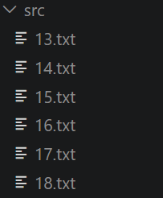
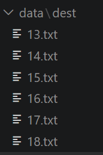
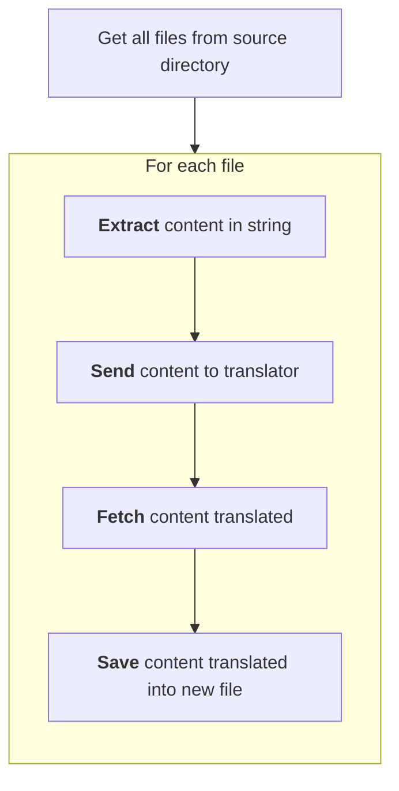

<h1 style="text-align:center;" >
 Jericho
</h1>

[](#)

[](https://github.com/NY-Daystar/Jericho/actions/workflows/python.yml)

[](https://github.com/NY-Daystar/Jericho/releases)

[](https://github.com/ny-daystar/jericho/releases)
[](https://sourcegraph.com/github.com/NY-Daystar/jericho)

  

  
 

# Summary

- [User Guide](#user-guide)
- [Requirements](#requirements)
- [For developers](#for-developers)
    - [Explainations](#explainations)
- [Contact](#contact)
- [Credits](#credits)

## User Guide


This application is a tool to translate english files to french files

1. Download `Jericho` project from
   [this link](https://github.com/NY-Daystar/Jericho/releases/download/v0.2.0/jericho.exe)

1. Launch `jericho.exe`

1. It gonna ask you the `source` folder containing files to translate (default: data/source) like below  
   

1. Then select the `target` folder to save translating (default: data/target)  
   

1. At now the application will translate each of your file into `target` folder

## Requirements

- [Python](https://www.python.org/) >= 3.14 && < 3.15

## For developers

### Setup project

1. You need to create a folder data/source with files to translate like this  
   

1. Clone repository

```bash
git clone git@github.com:NY-Daystar/Jericho.git
```

1. Open Jericho project
1. Install dependencies

```bash
poetry install --no-root
```

1. Launch project with

```bash
poetry run .
```

or

```bash
poetry run . --debug
```

You can activate git hooks with this command

```bash
git config --global core.hooksPath .githooks
```

### Explainations



## Contact

- To make a pull request: <https://github.com/NY-Daystar/jericho/pulls>
- To summon an issue: <https://github.com/NY-Daystar/jericho/issues>
- For any specific demand by mail: [luc4snoga@gmail.com](mailto:luc4snoga@gmail.com?subject=[GitHub]%jericho%20Project)

## Credits

Made by Lucas Noga.  
Licensed under GPLv3.
